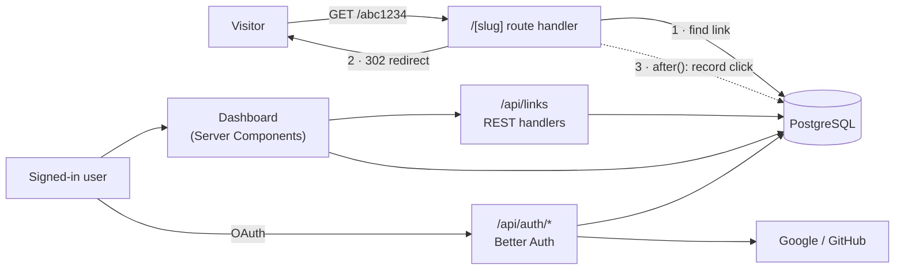
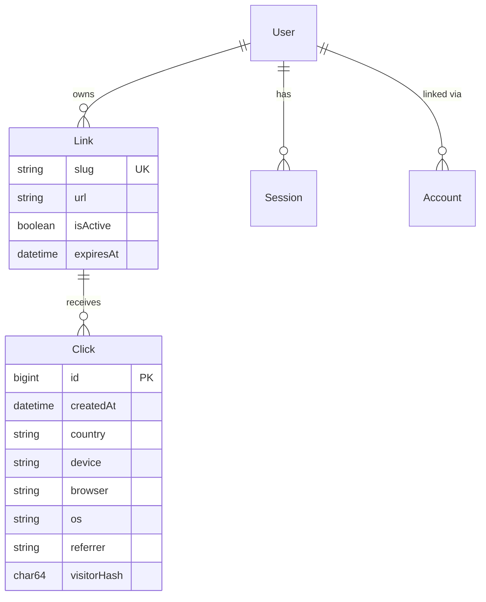

<div align="center">

# LumoraLink

**Link shortener with a privacy-friendly click analytics dashboard and QR codes.**

[**Live demo →**](https://lumoralink.vercel.app)

English · [Türkçe](README.tr.md)


</div>

<!-- SCREENSHOTS -->

## Features

- **Short links**: random 7-character codes or your own custom alias (`/summer-sale`)
- **Sign in with Google or GitHub**: OAuth only, no passwords stored
- **Click analytics per link**: total clicks, unique visitors, last 7 days, a 30-day chart, and breakdowns by referrer, country, device, browser and OS
- **QR codes**: preview on the dashboard, download as PNG (1024 px) or SVG (print-ready)
- **Link management**: change the destination, pause a link, set an expiry date, or delete it
- **Bot filtering**: search engine crawlers and link-preview bots (WhatsApp, Slack, Telegram…) are redirected but not counted
- **Rate limiting**: 10 links per minute and 100 per hour per user

## Tech stack

| Layer | Choice |
| --- | --- |
| Framework | Next.js 16 (App Router, Route Handlers, Server Components) + TypeScript |
| Database | PostgreSQL 17 · Prisma 7 with the `pg` driver adapter |
| Auth | Better Auth (Google + GitHub OAuth, database sessions) |
| Validation | Zod 4 |
| UI | Tailwind CSS 4; charts built with plain HTML/CSS (no chart library) |
| Hosting | Vercel (Frankfurt) + Neon serverless Postgres (Frankfurt) |
| Local dev | Docker Compose for Postgres |

## Architecture



The redirect path is kept as short as possible: one indexed lookup, then the response. The click is written **after** the response has been sent, using Next.js `after()`, so analytics never slow down the redirect.

## Data model



`Click` has a composite index on `(linkId, createdAt)`, which is exactly the shape of the dashboard query ("clicks of this link over the last 30 days").

## Technical decisions

**302, not 301.** A 301 is cached by the browser, so repeat visits would never reach the server and could not be counted. A 302 keeps every click measurable.

**Privacy-friendly unique visitors.** IP addresses are never stored. Each click stores `sha256(day | ip | user-agent | secret)`. Counting distinct hashes gives unique visitors, but because the day is part of the input the hash changes every day, so a person cannot be tracked across days, and the hash cannot be reversed to an IP.

**Aggregation happens in the database.** The 30-day chart is a single SQL query using `generate_series` + `LEFT JOIN`, so days with zero clicks still appear and nothing is aggregated in JavaScript. Dates are bucketed in the `Europe/Istanbul` time zone.

**Ownership checks that cannot race.** Updates and deletes use `updateMany` / `deleteMany` with `where: { id, userId }`. If the link belongs to someone else, zero rows are affected and the API answers 404, without leaking whether the link exists.

**Rate limiting without Redis.** On serverless platforms each request may run on a different instance, so an in-memory counter would not work. The limit is computed from the user's own `Link` rows (indexed by `userId`), which is enough at this scale and needs no extra service.

**Slugs are immutable.** You can change where a link points, but not its short code, because printed QR codes and shared links must keep working.

**One source of truth for link status.** `src/lib/link-status.ts` decides whether a link is active, paused or expired. The redirect handler, the dashboard badges and the settings page all use it, so they cannot disagree.

**Correct HTTP semantics.** `201` created, `204` deleted, `400` invalid input, `401` not signed in, `404` not found (or not yours), `409` alias taken, `410` link expired, `429` rate limited (with `Retry-After`).

## API

All `/api/links` endpoints require a session cookie.

| Method | Path | Description |
| --- | --- | --- |
| `POST` | `/api/links` | Create a link `{ url, customSlug? }` |
| `GET` | `/api/links` | List your latest links |
| `PATCH` | `/api/links/:id` | Update `{ url?, isActive?, expiresAt? }` |
| `DELETE` | `/api/links/:id` | Delete a link and its clicks |
| `GET` | `/api/links/:id/qr?format=png\|svg` | Download the QR code |
| `GET` | `/:slug` | Public redirect |
| `GET` | `/api/health` | Health check |

## Running locally

Requirements: Node.js 20+, Docker Desktop.

```bash
git clone https://github.com/highlvmami/lumoralink.git
cd lumoralink
npm install              # installs dependencies and generates the Prisma client
cp .env.example .env     # Windows: copy .env.example .env
npm run db:up            # starts PostgreSQL in Docker
npm run db:migrate       # creates the tables
npm run dev              # http://localhost:3000
```

To sign in locally, create a [GitHub OAuth app](https://github.com/settings/applications/new) with the callback URL `http://localhost:3000/api/auth/callback/github` and put its credentials in `.env`. Google works the same way with `/api/auth/callback/google`.

### Environment variables

| Variable | Description |
| --- | --- |
| `DATABASE_URL` | PostgreSQL connection string (pooled connection in production) |
| `DIRECT_URL` | Direct connection used by migrations (optional locally) |
| `BETTER_AUTH_SECRET` | Random secret for signing sessions (32+ characters) |
| `BETTER_AUTH_URL` | Public URL of the app |
| `NEXT_PUBLIC_APP_URL` | Base URL used for short links and QR codes |
| `GITHUB_CLIENT_ID` / `GITHUB_CLIENT_SECRET` | GitHub OAuth app |
| `GOOGLE_CLIENT_ID` / `GOOGLE_CLIENT_SECRET` | Google OAuth client |

### Scripts

| Command | What it does |
| --- | --- |
| `npm run dev` | Development server |
| `npm run build` | Production build |
| `npm run lint` | ESLint |
| `npm run db:up` / `db:down` | Start / stop the Postgres container |
| `npm run db:migrate` | Apply schema changes and regenerate the client |
| `npm run db:studio` | Browse the database in Prisma Studio |

## Deployment

Every push to `main` is deployed to Vercel automatically. The build command is `npm run vercel-build`, which runs `prisma migrate deploy` before `next build`, so the production database schema is always in sync with the code.

## Project structure

```
src/
├── app/
│   ├── [slug]/route.ts            # public redirect + click recording
│   ├── api/links/…                # REST API (create, list, update, delete, QR)
│   ├── api/auth/[...all]/         # Better Auth endpoints
│   ├── dashboard/                 # link list and per-link analytics
│   ├── login/ · privacy/          # public pages
│   └── page.tsx                   # landing page
├── components/                    # UI (chart, breakdown lists, settings form…)
└── lib/
    ├── analytics.ts               # user-agent parsing, bot filter, visitor hash
    ├── stats.ts                   # analytics SQL queries
    ├── link-status.ts             # active / paused / expired rule
    ├── rate-limit.ts              # per-user limits
    ├── validation.ts              # Zod schemas
    └── auth.ts · prisma.ts · qr.ts
prisma/
├── schema.prisma
└── migrations/
```

## Roadmap

- [ ] Automated tests (Vitest + Playwright) and GitHub Actions CI
- [ ] Dockerfile for a one-command local setup
- [ ] Password-protected links
