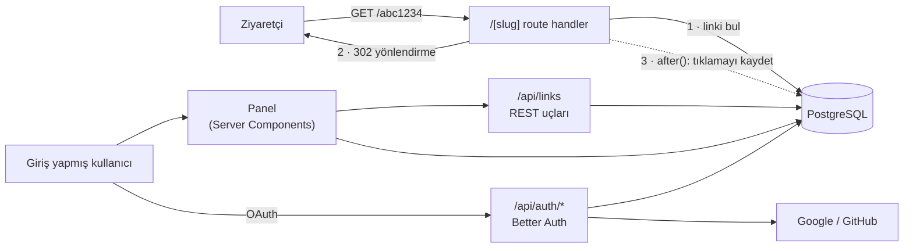
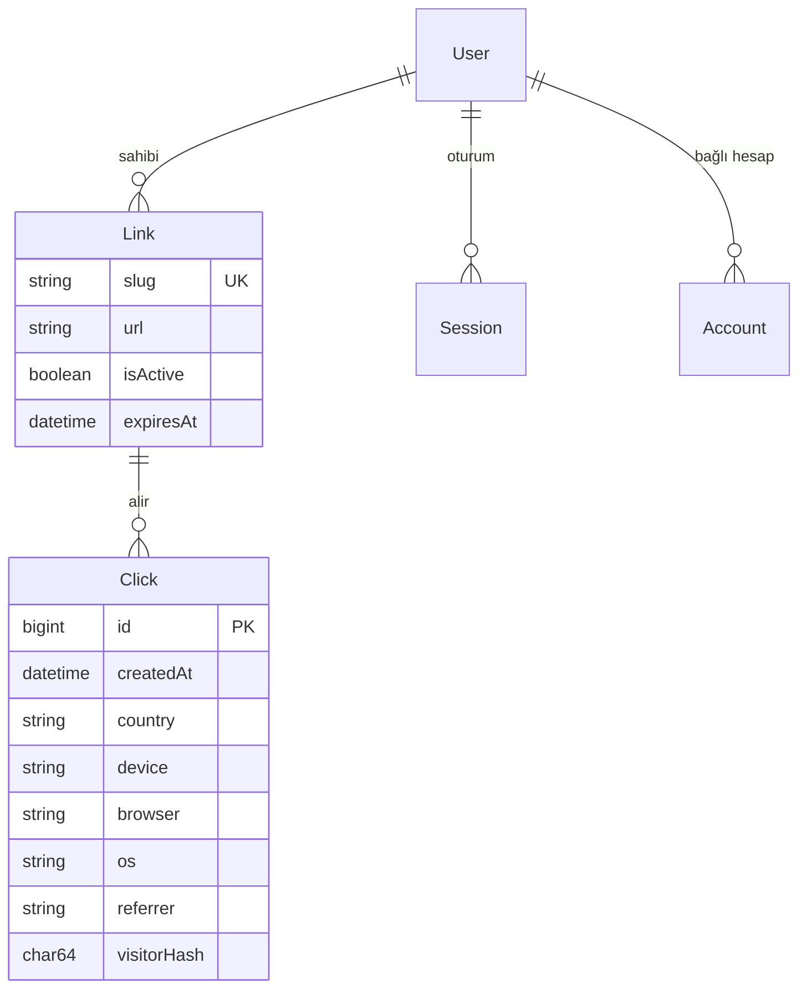

<div align="center">

# LumoraLink

**Gizlilik dostu tıklama analitiği ve QR kod üretimi sunan link kısaltıcı.**

[**Canlı demo →**](https://lumoralink.vercel.app)

[English](README.md) · Türkçe


</div>

<!-- SCREENSHOTS -->

## Özellikler

- **Kısa linkler**: 7 karakterlik rastgele kod ya da kendi seçtiğin kısa ad (`/yaz-kampanyasi`)
- **Google veya GitHub ile giriş**: yalnızca OAuth, hiçbir şifre saklanmaz
- **Link bazında tıklama analitiği**: toplam tıklama, tekil ziyaretçi, son 7 gün, 30 günlük grafik; kaynak site, ülke, cihaz, tarayıcı ve işletim sistemi dağılımı
- **QR kod**: panelde önizleme, PNG (1024 px) veya baskıya uygun SVG olarak indirme
- **Link yönetimi**: hedef adresi değiştirme, linki durdurma, son kullanma tarihi, silme
- **Bot filtresi**: arama motoru botları ve link önizleme botları (WhatsApp, Slack, Telegram…) yönlendirilir ama sayılmaz
- **Hız sınırı**: kullanıcı başına dakikada 10, saatte 100 link

## Teknolojiler

| Katman | Seçim |
| --- | --- |
| Framework | Next.js 16 (App Router, Route Handlers, Server Components) + TypeScript |
| Veritabanı | PostgreSQL 17 · `pg` sürücü adaptörüyle Prisma 7 |
| Kimlik doğrulama | Better Auth (Google + GitHub OAuth, veritabanı oturumları) |
| Doğrulama | Zod 4 |
| Arayüz | Tailwind CSS 4; grafikler kütüphane kullanmadan HTML/CSS ile çizildi |
| Barındırma | Vercel (Frankfurt) + Neon sunucusuz Postgres (Frankfurt) |
| Yerel geliştirme | Postgres için Docker Compose |

## Mimari



Yönlendirme yolu olabildiğince kısa tutuldu: indeksli tek bir sorgu, ardından cevap. Tıklama kaydı, Next.js'in `after()` fonksiyonuyla cevap gönderildikten **sonra** yazılıyor. Böylece analitik, yönlendirmeyi hiç yavaşlatmıyor.

## Veri modeli



`Click` tablosunda `(linkId, createdAt)` üzerinde bileşik indeks var. Bu indeks, panelin yaptığı "bu linkin son 30 gündeki tıklamaları" sorgusuna birebir uyuyor.

## Teknik kararlar

**301 değil, 302.** 301 kalıcı yönlendirmedir ve tarayıcı onu önbelleğe alır. Sonraki ziyaretler sunucuya hiç uğramadığı için sayılamaz. 302 ile her tıklama ölçülebilir kalıyor.

**Gizlilik dostu tekil ziyaretçi sayımı.** IP adresleri hiçbir zaman saklanmıyor. Her tıklamada `sha256(gün | ip | user-agent | gizli anahtar)` değeri tutuluyor. Farklı hash'leri saymak tekil ziyaretçi sayısını veriyor. Hesaplamaya gün de girdiği için hash her gün değişiyor, bu yüzden aynı kişi günler arasında takip edilemiyor. Hash'ten IP adresine geri dönülemiyor.

**Hesaplamalar veritabanında yapılıyor.** 30 günlük grafik, `generate_series` ve `LEFT JOIN` kullanan tek bir SQL sorgusuyla üretiliyor. Tıklama olmayan günler de 0 olarak geliyor ve JavaScript tarafında hiçbir toplama yapılmıyor. Günler `Europe/Istanbul` saat dilimine göre gruplanıyor.

**Yarış durumuna açık olmayan sahiplik kontrolü.** Güncelleme ve silme işlemleri `where: { id, userId }` koşuluyla `updateMany` / `deleteMany` kullanıyor. Link başkasına aitse hiçbir satır etkilenmiyor ve API `404` dönüyor. Linkin var olup olmadığı bilgisi bile sızmıyor.

**Redis'siz hız sınırı.** Sunucusuz platformlarda her istek farklı bir makinede çalışabildiği için bellekte tutulan bir sayaç işe yaramaz. Sınır, kullanıcının `userId` ile indekslenmiş kendi `Link` kayıtlarından hesaplanıyor. Bu ölçek için yeterli ve ek bir servis gerektirmiyor.

**Kısa adlar değiştirilemez.** Bir linkin yönlendirdiği adres değiştirilebiliyor, ama kısa kodu değiştirilemiyor. Basılmış QR kodlar ve paylaşılmış linkler çalışmaya devam etmeli.

**Link durumu için tek kaynak.** Bir linkin aktif, durdurulmuş ya da süresi dolmuş olduğuna `src/lib/link-status.ts` karar veriyor. Yönlendirme, paneldeki etiketler ve ayarlar sayfası aynı fonksiyonu kullandığı için birbirleriyle çelişemiyor.

**Doğru HTTP kodları.** `201` oluşturuldu, `204` silindi, `400` geçersiz veri, `401` giriş yapılmadı, `404` bulunamadı (ya da senin değil), `409` kısa ad kullanımda, `410` linkin süresi doldu, `429` hız sınırı aşıldı (`Retry-After` başlığıyla).

## API

Tüm `/api/links` uçları oturum çerezi gerektirir.

| Metot | Yol | Açıklama |
| --- | --- | --- |
| `POST` | `/api/links` | Link oluştur `{ url, customSlug? }` |
| `GET` | `/api/links` | Son linklerini listele |
| `PATCH` | `/api/links/:id` | Güncelle `{ url?, isActive?, expiresAt? }` |
| `DELETE` | `/api/links/:id` | Linki ve tıklamalarını sil |
| `GET` | `/api/links/:id/qr?format=png\|svg` | QR kodu indir |
| `GET` | `/:slug` | Herkese açık yönlendirme |
| `GET` | `/api/health` | Sağlık kontrolü |

## Yerelde çalıştırma

Gerekenler: Node.js 20+, Docker Desktop.

```bash
git clone https://github.com/highlvmami/lumoralink.git
cd lumoralink
npm install              # bağımlılıkları kurar ve Prisma client'ı üretir
cp .env.example .env     # Windows: copy .env.example .env
npm run db:up            # PostgreSQL'i Docker'da başlatır
npm run db:migrate       # tabloları oluşturur
npm run dev              # http://localhost:3000
```

Yerelde giriş yapabilmek için geri dönüş adresi `http://localhost:3000/api/auth/callback/github` olan bir [GitHub OAuth uygulaması](https://github.com/settings/applications/new) oluştur ve bilgilerini `.env` dosyasına yaz. Google da aynı şekilde, `/api/auth/callback/google` adresiyle çalışır.

### Ortam değişkenleri

| Değişken | Açıklama |
| --- | --- |
| `DATABASE_URL` | PostgreSQL bağlantı adresi (canlıda pooled bağlantı) |
| `DIRECT_URL` | Migration'ların kullandığı doğrudan bağlantı (yerelde isteğe bağlı) |
| `BETTER_AUTH_SECRET` | Oturumları imzalamak için rastgele gizli anahtar (32+ karakter) |
| `BETTER_AUTH_URL` | Uygulamanın herkese açık adresi |
| `NEXT_PUBLIC_APP_URL` | Kısa linklerde ve QR kodlarda kullanılan kök adres |
| `GITHUB_CLIENT_ID` / `GITHUB_CLIENT_SECRET` | GitHub OAuth uygulaması |
| `GOOGLE_CLIENT_ID` / `GOOGLE_CLIENT_SECRET` | Google OAuth istemcisi |

### Komutlar

| Komut | Ne yapar |
| --- | --- |
| `npm run dev` | Geliştirme sunucusu |
| `npm run build` | Production derlemesi |
| `npm run lint` | ESLint |
| `npm run db:up` / `db:down` | Postgres konteynerini başlat / durdur |
| `npm run db:migrate` | Şema değişikliklerini uygula ve client'ı yeniden üret |
| `npm run db:studio` | Veritabanını Prisma Studio'da görüntüle |

## Yayına alma

`main` dalına yapılan her push, Vercel'e otomatik olarak yayınlanıyor. Build komutu `npm run vercel-build`. Bu komut `next build` öncesinde `prisma migrate deploy` çalıştırdığı için canlı veritabanının şeması her zaman kodla uyumlu kalıyor.

## Proje yapısı

```
src/
├── app/
│   ├── [slug]/route.ts            # herkese açık yönlendirme + tıklama kaydı
│   ├── api/links/…                # REST API (oluştur, listele, güncelle, sil, QR)
│   ├── api/auth/[...all]/         # Better Auth uçları
│   ├── dashboard/                 # link listesi ve link bazında analitik
│   ├── login/ · privacy/          # herkese açık sayfalar
│   └── page.tsx                   # tanıtım sayfası
├── components/                    # arayüz (grafik, dağılım listeleri, ayarlar formu…)
└── lib/
    ├── analytics.ts               # user-agent çözümleme, bot filtresi, ziyaretçi hash'i
    ├── stats.ts                   # analitik SQL sorguları
    ├── link-status.ts             # aktif / durdurulmuş / süresi dolmuş kuralı
    ├── rate-limit.ts              # kullanıcı başına sınırlar
    ├── validation.ts              # Zod şemaları
    └── auth.ts · prisma.ts · qr.ts
prisma/
├── schema.prisma
└── migrations/
```

## Yol haritası

- [ ] Otomatik testler (Vitest + Playwright) ve GitHub Actions CI
- [ ] Tek komutla yerel kurulum için Dockerfile
- [ ] Şifre korumalı linkler
